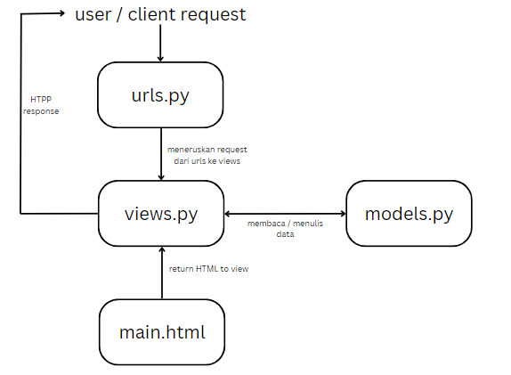

Nama : Arya Gilang P

NPM : 2306221970

Kelas : PBP F

link : https://arya-gilang-thediecastshop.pbp.cs.ui.ac.id/

## Proses Pembuatan Projek Django

**Membuat project django baru**
1. membuat repository Github baru bernama 'the-diecast-shop'
2. clone repository kosong ke komputer lokal dengan perintah **git clone https://github.com/AryaGilangP/the-diecast-shop**
3. menghubungkan penyimpanan lokal dengan Github **git remote add origin https://github.com/AryaGilangP/the-diecast-shop**
4. membuat virtual enviroment dan mengaktifkannya
5. membuat file bernama `requirements.txt` lalu menginstall dependensi yang ada di file tersebut
6. buat project django baru 
7. menjalankan server dengan mengubah isi dari allowed hosts, lalu memeriksanya di 'http://localhost:8000''

**Membuat aplikasi dengan nama 'main' pada project tersebut
lalu mendaftarkannya ke dalam 'INSTALLED_APPS'***

**Melakukan routing pada 'main' agar dapat menjalankan aplikasi**
hal ini dilakukan agar web yang kita buat dapat diakses melalui web

**Membuat model pada 'main' dengan nama produk dan atribut atribut tertentu** 
didalam 'models.py' aku menambahkan beberapa atribut seperti, 'name' ,'price' , 'description' , 'models' , 'customer_review'

**Melakukan deployment ke PWS terhadap aplikasi yang sudah dibuat**
NOTE : disini saya melakukan deployment saat PWS masih sedang error dan itu sudah H-1 deadline jadi sampai sekarang sebenarnya juga masih failed sih

## Request Client ke Web Aplikasi Berbasis Django

https://www.canva.com/design/DAGQaVKWqVw/UOididZ0zkWlrKeqb3VXSQ/edit?utm_content=DAGQaVKWqVw&utm_campaign=designshare&utm_medium=link2&utm_source=sharebutton

## Fungsi Git pada Pengembangan Perangkat Lunak

Git adalah sistem kontrol versi terdistribusi yang berfungsi untuk melacak perubahan dalam kode sumber selama pengembangan perangkat lunak. Dalam pengembangan perangkat lunak, Git memiliki beberapa fungsi penting, antara lain:

Pelacakan Perubahan (Version Control) Kolaborasi Tim Pengembangan Paralel (Branching) Audit dan Pemantauan Manajemen Repositori Terdistribusi

Alasan Framework Django Dijadikan Permulaan Pembelajaran Pengembangan Perangkat Lunak Struktur yang Jelas dan Terorganisir: Django adalah framework yang memiliki struktur proyek yang sangat jelas dan terorganisir, sehingga memudahkan pemula untuk memahami bagaimana aplikasi web diorganisir. Django menggunakan pola arsitektur Model-View-Template (MVT) yang serupa dengan pola Model-View-Controller (MVC) yang umum digunakan di banyak framework.