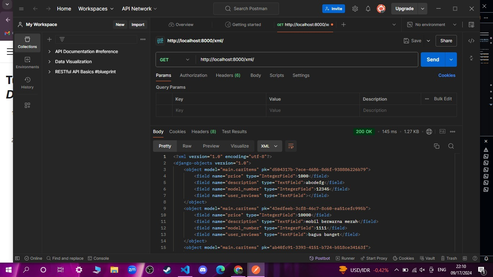
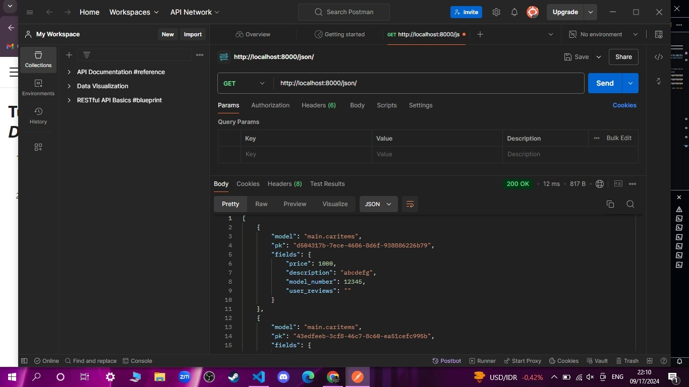
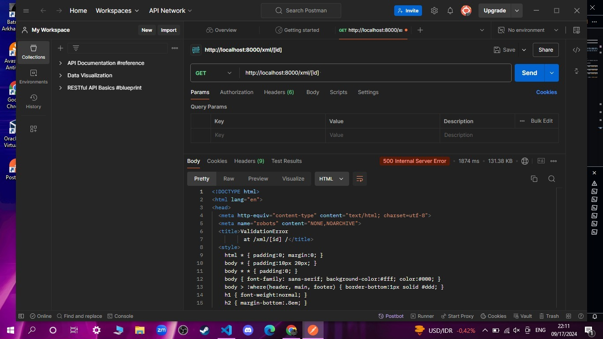
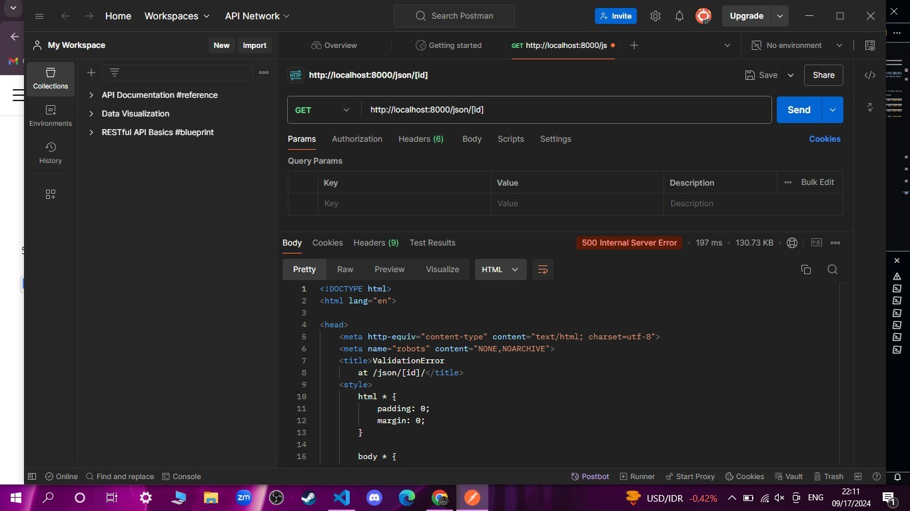

Nama : Arya Gilang P

NPM : 2306221970

Kelas : PBP F

link : http://pbp.cs.ui.ac.id/arya.gilang/fufufafashop

Username: arya.gilang
Password: zBOBx6IUQKGmfPj4rJg2tpXAHSud_w4d

atha.nextkabiro2025
gilangiyan.nextdeputi2025

## README UNTUK TUGAS 2

<details>
  <summary></summary>

## Proses Pembuatan Projek Django

**Membuat project django baru**
1. membuat repository Github baru bernama 'the-diecast-shop'
2. clone repository kosong ke komputer lokal dengan perintah **git clone https://github.com/AryaGilangP/the-diecast-shop**
3. menghubungkan penyimpanan lokal dengan Github **git remote add origin https://github.com/AryaGilangP/the-diecast-shop**
4. membuat virtual enviroment dan mengaktifkannya
5. membuat file bernama `requirements.txt` lalu menginstall dependensi yang ada di file tersebut
6. buat project django baru 
7. menjalankan server dengan mengubah isi dari allowed hosts, lalu memeriksanya di **http://localhost:8000**

**Membuat aplikasi dengan nama `main` pada project tersebut
lalu mendaftarkannya ke dalam `INSTALLED_APPS`**

**Melakukan routing pada 'main' agar dapat menjalankan aplikasi**
hal ini dilakukan agar web yang kita buat dapat diakses melalui web

**Membuat model pada `models.py` dengan nama produk dan atribut atribut tertentu** 
didalam 'models.py' aku menambahkan beberapa atribut seperti, `name` ,`price` , `description` , `models` , `customer_review`
 
**Melakukan deployment ke PWS terhadap aplikasi yang sudah dibuat**
NOTE : disini saya melakukan deployment saat PWS masih sedang error dan itu sudah H-1 deadline jadi sampai sekarang sebenarnya juga masih failed sih

## Request Client ke Web Aplikasi Berbasis Django


https://www.canva.com/design/DAGQaVKWqVw/UOididZ0zkWlrKeqb3VXSQ/edit?utm_content=DAGQaVKWqVw&utm_campaign=designshare&utm_medium=link2&utm_source=sharebutton

## Fungsi Git pada Pengembangan Perangkat Lunak

Git adalah sistem kontrol versi terdistribusi yang berfungsi untuk melacak perubahan dalam kode sumber selama pengembangan perangkat lunak. Dalam pengembangan perangkat lunak, Git memiliki beberapa fungsi penting, antara lain:

Pelacakan Perubahan (Version Control) Kolaborasi Tim Pengembangan Paralel (Branching) Audit dan Pemantauan Manajemen Repositori Terdistribusi

Alasan Framework Django Dijadikan Permulaan Pembelajaran Pengembangan Perangkat Lunak Struktur yang Jelas dan Terorganisir: Django adalah framework yang memiliki struktur proyek yang sangat jelas dan terorganisir, sehingga memudahkan pemula untuk memahami bagaimana aplikasi web diorganisir. Django menggunakan pola arsitektur Model-View-Template (MVT) yang serupa dengan pola Model-View-Controller (MVC) yang umum digunakan di banyak framework.

Username: arya.gilang
Password: YZ2XcNa_hJsp6Jk-QViot7lKfis2gd6B

</details>

## README UNTUK TUGAS 3

<details>
  <summary></summary>

**Membuat input form untuk menambahkan objek model pada app sebelumnya.**  

dimulai dengan membuat `forms.py` pada untuk membuat forms yang bisa menerima data baru. Form menggunakan model `CarItems` yang mencakup field yang relevan. Setelah itu kita perbarui kode `views.py` dengan menambahkan fungsi `create_car_items`yang dapat menerima data, memvalidasi input, serta menyimpan data tersebut. Lalu ketika berhasil aka aka di redirect ke halaman utama, dan `views.py` dan `main.html` dimodifikasi untuk menampilkan semua item mobil yang sudah dibuat.

**Tambahkan 4 fungsi views baru untuk melihat objek yang sudah ditambahkan dalam format XML, JSON, XML by ID, dan JSON by ID.**

1. Format XML
menambahkan fungsi `show_xml` yang mengambil seluruh data dari entry `CarItems` menggunakan `CarItems.objects.all()` yang akan return hasil dengan type XML.

        ```
        def show_xml(request):
            data = CarItems.objects.all()
            return HttpResponse(serializers.serialize("xml", data), content_type="application/xml")
            ```

2.  Format JSON
     `show_json` serupa dengan `show_xml`, yang akan mengembalikan hasil dengan tipe JSON.  
         
       ```
       def show_json(request):
            data = CarItems.objects.all()
            return HttpResponse(serializers.serialize("json", data), content_type="application/json")
       ```
       
3. XML by ID dan JSON by ID
    `show_xml_by_id` dan `show_json_by_id` digunakan untuk mengambil data `CarItems` menggunakan ID. Query dilakukan menggunakan `data = MoodEntry.objects.filter(pk=id)` untuk mengambil data sesuai ID, lalu diubah menjadi format XML atau JSON sesuai yang dipanggil. Untuk memanggilnya kita bisa menambahkan ID di belakang URL.  
        
      ```
      def show_xml_by_id(request, id):
            data = CarItems.objects.filter(pk=id)
            return HttpResponse(serializers.serialize("xml", data), content_type="application/xml")
      ```  
  
      ```
      def show_json_by_id(request, id):
            data = CarItems.objects.filter(pk=id)
            return HttpResponse(serializers.serialize("json", data), content_type="application/json")
      ``` 

**Membuat routing URL untuk masing-masing views yang telah ditambahkan pada poin 2.**  

URL ditambahkan pada file `urls.py` spaya fungsi pada `views.py` bisa diakses.

```
urlpatterns = [
    path('', show_main, name='show_main'),
    path('create-car-item', create_car_item, name='create_car_item'),
    path('xml/', show_xml, name='show_xml'),
    path('json/', show_json, name='show_json'),
    path('xml/<str:id>/', show_xml_by_id, name='show_xml_by_id'),
    path('json/<str:id>/', show_json_by_id, name='show_json_by_id'),
]
```

## Mengapa kita memerlukan data delivery dalam pengimplementasian sebuah platform?
Karena menghubungkan pengguna dengan server untuk memberikan informasi, layanan, dan konten secara efisien. Tanpa data delivery, pengguna tidak bisa mendapatkan akses real-time terhadap data yang dibutuhkan seperti konten dinamis, transaksi, atau interaksi antar pengguna.

## Mana yang lebih baik antara XML dan JSON? Mengapa JSON lebih populer dibandingkan XML?
JSON dianggap lebih populer karena sintaks simpel dan ringan karena menggunakan struktur key-value yang lebih ringkas dibandingkan dengan tag yang lebih berat di XML. Struktur data yang alami, sehingga JSON sangat cocok untuk merepresentasikan objek data dalam bahasa pemrograman, seperti array dan objek. JSON menjadi lebih populer karena kesederhanaannya, kinerjanya yang efisien, dan dukungan luas di lingkungan pemrograman modern seperti JavaScript, Python, dan lainnya. JSON juga lebih mudah dipahami oleh manusia dan mesin dibandingkan dengan XML.

## Fungsi dari Method `is_valid()` pada Form Django dan Mengapa Kita Membutuhkannya?
Memeriksa validitas data yang diinput ke dalam form, apakah sesuai dengan aturan yang ditetapkan (misalnya, panjang teks, format email, atau tipe data).
Mengidentifikasi error dalam input form, jika ada kesalahan, method ini memungkinkan kita untuk mendapatkan informasi tentang kesalahan tersebut melalui atribut `form.errors`.

## Mengapa Kita Membutuhkan `csrf_token` saat Membuat Form di Django? Apa yang Dapat Terjadi Jika Kita Tidak Menambahkannya? Bagaimana Hal Tersebut Dapat Dimanfaatkan oleh Penyerang?
`csrf_token` memastikan bahwa setiap permintaan POST yang dilakukan melalui form di Django benar-benar berasal dari sumber yang sah (yaitu pengguna yang sebenarnya), bukan dari situs eksternal yang berbahaya.
Tanpa `csrf_token`, form menjadi rentan terhadap serangan CSRF, di mana penyerang bisa mengarahkan pengguna ke sebuah halaman web atau email berbahaya yang mengirimkan permintaan tak sah atas nama pengguna tersebut, seperti transfer dana, pengubahan pengaturan akun, atau tindakan lainnya. Penyerang dapat membuat pengguna yang sudah login ke aplikasi melakukan aksi yang tidak disengaja, seperti mengirim data ke server tanpa sepengetahuan pengguna.

## POSTMAN
**XML**


**JSON**


**XML by ID**


**JSON by ID**


</details>

## README UNTUK TUGAS 4

<details>
  <summary></summary>

**Mengimplementasikan fungsi registrasi, login, dan logout untuk memungkinkan pengguna untuk mengakses aplikasi sebelumnya dengan lancar.**

Implementasi fungsi `registrasi`, `login`, dan `logout` pada aplikasi Django bertujuan untuk mengatur akses pengguna ke halaman yang di-restrict, seperti halaman utama pada aplikasi.

Fungsi `register` bertujuan untuk membuat akun pengguna baru agar mereka bisa login dan mengakses halaman yang dibatasi. Fungsi ini ditambahkan pada file `views.py` pada direktori `main`. Tampilan registrasi akan di-handle oleh `register.html` pada direktori `main`, yang menggunakan `UserCreationForm` dari Django yang akan menyediakan formulir pendaftaran untuk akun baru. Selanjutnya, pengguna akan mengirimkan data melalui form yang datanya akan divalidasi menggunakan `form.is_valid()`. Jika valid, nantinya akun baru akan disimpan pada `form.save()`. Setelah itu, pengguna akan mendapat pesan berhasil dan akan diarahkan kembali ke halaman `login`.

Untuk autentikasi pengguna agar bisa login, ditambahkan fungsi yang menggunakan `AuthenticationForm` dari Django. Fungsi ini ditambahkan pada file `views.py` pada direktori `main`, lalu tampilannya akan di-handle oleh file `login.html` yang berada pada direktori `main`. Dan jika valid, pengguna berhasil diidentifikasi dengan `form.get_user()`. Setelah validasi, fungsi `login(request, user)` digunakan untuk melakukan proses login, menciptakan sesi baru untuk pengguna yang berhasil login.

Selanjutnya untuk menghubungkan Product dan User untuk memetakan kepemilikan user atas item baru yang dibuatnya.Ini dilakukan dengan cara import model `User` pada `models.py` dan menambahkan `ForeignKey` pada model `Product`
```
class Product(models.Model): 
    user = models.ForeignKey(User, on_delete=models.CASCADE)
```

Lalu kita ubah fungsi `create_car_item`
```
def create_car_item(request):
    form = CarItemsForm(request.POST or None)

    if form.is_valid() and request.method == "POST":
        car_item = form.save(commit=False)
        car_item.user = request.user
        car_item.save()
        return redirect('main:show_main')

    context = {'form': form}
    return render(request, "create_car_item.html", context)
```

Selanjutnya ubah value dari `car_items` pada context pada `show_main`
```
def show_main(request):
    car_items = CarItems.objects.filter(user=request.user)  

    context = {
        'app': 'Mobil Kecil',
        'name': request.user.username,
        'car_items': car_items,
```

Selanjutnya lakukan migrasi. Lalu akan ada error yang kita harus memilih ketik 1 untuk menetapkan user dengan ID 1 pada model yang ada. Lalu `import os` pada `settings.py`
```
PRODUCTION = os.getenv("PRODUCTION", False)
DEBUG = not PRODUCTION
```

**Menampilkan detail informasi pengguna**

Lakukan import pada `views.py` di `main`, dan tambahkan
```
import datetime
from django.http import HttpResponseRedirect
from django.urls import reverse
```

Menambahkan cookie `last_login` pada fungsi `login_user `dengan mengubah kode menjadi berikut:
```
if form.is_valid():
    user = form.get_user()
    login(request, user)
    response = HttpResponseRedirect(reverse("main:show_main"))
    response.set_cookie('last_login', str(datetime.datetime.now()))
    return response
```
Untuk menampilkan `last_login`, tambahkan kode ini ke variabel context pada `show_main`
```
'last_login': request.COOKIES['last_login']
```
Ubah fungsi logout_user untuk menghapus cookie
```
def logout_user(request):
    logout(request)
    response = HttpResponseRedirect(reverse('main:login'))
    response.delete_cookie('last_login')
    return response
```
Tambahkan ke `main.html` untuk menampilkan informasi terakhir login pada halaman utama
```
<h5>Sesi terakhir login: {{ last_login }}</h5>
```

## Perbedaan antara `HttpResponseRedirect()` dan `redirect()`
`HttpResponseRedirect()` digunakan untuk mengarahkan pengguna ke URL tertentu. URL yang diberikan harus ditentukan secara manual. Misalnya, jika kita ingin mengarahkan pengguna ke halaman tertentu harus menulis URL target secara eksplisit
`redirect()` bisa menerima URL, view name, bahkan objek model dan  Django akan secara otomatis menangani konversi nama view atau nama URL menjadi URL penuh di backend, sehingga penggunaan redirect() sangat efisien dalam pengembangan aplikasi berbasis web.

## Cara kerja penghubungan model Product dengan User
Model Product dan User akan dihubungkan menggunakan `ForeignKey` agar setiap produk memiliki pemilik yang jelas. Lalu fungsi `create_car_item` akan menambahkan informasi pemiliknya, atau user yang sedang login. Nantinya setiap produk akan memiliki kaitan terhadap pengguna yang terautentikasi saat pembuatan.
Fungsi `show_main` hanya akan menampilkan produk milik pengguna yang sedang login menggunakan filter `Product.objects.filter(user=request.user)`. Setelah perubahan dilakukan, harus dilakukan migrasi database, yang apabila error maka pilihlah option 1 untuk menetapkan `user` dengan ID 1. Setelah itu, pengaturan `DEBUG` juga harus diubah agar bisa aktif di mode development.

## Perbedaan antara authentication dan authorization, apakah yang dilakukan saat pengguna login dan bagaimana Django mengimplementasikan kedua konsep tersebut.

Autentikasi adalah proses verifikasi identitas pengguna, melalui kombiasi antara username dan password
Dan jika valid, nantinya fungsi `login()` akan digunakan untuk membuat sesi dan menyimpan status login pengguna. Session ID kemudian disimpan di cookie untuk mengingat pengguna yang sudah login di setiap request berikutnya.

Authorization adalah untuk menentukan apabila sebuah pengguna telah diautentikasi memiliki izin/akses untuk melakukan tindakan tertentu (misalnya perbedaan akses antara dosen, asdos dan mahasiswa di SCELE)
Hal ini dikelola melalui decorators seperti `@login_required` yang berguna untuk memastikan pengguna hanya bisa mengakses halaman tertentu setelah login. Django juga menggunakan permission_required untuk membatasi akses berdasarkan batasan tertentu, seperti hanya admin yang dapat mengakses halaman tertentu.

## Bagaimana Django mengingat pengguna yang telah login? Jelaskan kegunaan lain dari cookies dan apakah semua cookies aman digunakan?
Django menggunakan session dan cookies untuk mengingat pengguna yang telah login.

**Session:** Django menyimpan informasi pengguna dalam session di server. Setiap pengguna yang login akan memiliki session yang unik.

**Cookie:** Django mengirimkan session ID ke browser pengguna dalam bentuk cookie. Pada setiap permintaan, browser mengirimkan kembali session ID ini sehingga Django dapat mengaitkan permintaan tersebut dengan session yang sesuai di server.

Cara kerjanya adalah saat pengguna berhasil login, Django menyimpan session ID di cookie browser.
Django kemudian mengaitkan session ID tersebut dengan data pengguna yang diotentikasi.
Setiap permintaan berikutnya dari pengguna akan menyertakan session ID ini dalam cookie, sehingga Django dapat mengetahui siapa pengguna tersebut dan memuat data yang relevan dari session.

</details>

## README UNTUK TUGAS 5

<details>
<summary></summary>

## Implementasi hapus dan edit produk

Membuat fungsi `edit_car` yang menerima parameter request dan id, lalu melakukan import pada `views.py` dan membuat file baru `edit_car.html`
Lalu import fungsi `edit_car` pada `urls.py`
```
def edit_car(request, id):
    car = CarItems.objects.get(pk=id)
    form = CarItemsForm(request.POST or None, instance=car)

    if form.is_valid() and request.method == "POST":
        form.save()
        return HttpResponseRedirect(reverse('main:show_main'))

    context = {'form': form}
    return render(request, "edit_car.html", context)
```
```



<title>Edit Car</title>




<div class="flex flex-col min-h-screen bg-gray-100">
  <div class="container mx-auto px-4 py-8 mt-16 max-w-xl">
    <h1 class="text-3xl font-bold text-center mb-8 text-black">Edit Car Item</h1>
  
    <div class="bg-white rounded-lg p-6 form-style">
      <form method="POST" class="space-y-6">
          
          
              <div class="flex flex-col">
                  <label for="{{ field.id_for_label }}" class="mb-2 font-semibold text-gray-700">
                      {{ field.label }}
                  </label>
                  <div class="w-full">
                      {{ field }}
                  </div>
                  
                      <p class="mt-1 text-sm text-gray-500">{{ field.help_text }}</p>
                  
                  
                      <p class="mt-1 text-sm text-red-600">{{ error }}</p>
                  
              </div>
          
          <div class="flex justify-center mt-6">
              <button type="submit" class="bg-indigo-600 text-white font-semibold px-6 py-3 rounded-lg hover:bg-indigo-700 transition duration-300 ease-in-out w-full">
                  Edit Car Item
              </button>
          </div>
      </form>
  </div>
  </div>
</div>

```

Membuat fungsi `delete_car` yang menerima parameter request dan id, lalu melakukan import pada `views.py`
Lalu import fungsi `delete_car` pada `urls.py`
```
def delete_car(request, id):
    # Get car berdasarkan id
    car = CarItems.objects.get(pk = id)
    # Hapus mood
    car.delete()
    # Kembali ke halaman awal
    return HttpResponseRedirect(reverse('main:show_main'))
```

## Kustomisasi halaman login, register, dan tambah product semenarik mungkin.

Untuk login, aku merubah warna utama menjadi hitam dan merah, serta menambahkan background image
Untuk register page, aku juga memberikan background hitam dan box berwarna biru oligarki untuk register nya

## Buatlah navigation bar (navbar) untuk fitur-fitur pada aplikasi yang responsive terhadap perbedaan ukuran device, khususnya mobile dan desktop.

```
<nav class="bg-red-600 shadow-lg fixed top-0 left-0 z-40 w-full">
  <div class="max-w-7xl mx-auto px-4 sm:px-6 lg:px-8">
    <div class="flex items-center justify-between h-16">
      <div class="flex items-center">
        <h1 class="text-2xl font-bold text-center text-white"> FUFUFAFA STORE </h1>
      </div>
      <!-- Versi desktop -->
      <div class="hidden md:flex items-center space-x-4">
        <a href="#" class="text-white">Home</a>
        <a href="#" class="text-white">Products</a>
        <a href="#" class="text-white">Categories</a>
        <a href="#" class="text-white">Cart</a>
        
          <span class="text-gray-300">Welcome, {{ user.username }}</span>
          <a href="" class="text-center bg-red-500 hover:bg-red-600 text-white font-bold py-2 px-4 rounded transition duration-300">
            Logout
          </a>
        
          <a href="" class="text-center bg-red-500 hover:bg-red-600 text-white font-bold py-2 px-4 rounded transition duration-300">
            Login
          </a>
        
      </div>
      <!-- Tombol hamburger untuk mobile -->
      <div class="md:hidden flex items-center">
        <button class="mobile-menu-button">
          <svg class="w-6 h-6 text-white" fill="none" stroke-linecap="round" stroke-linejoin="round" stroke-width="2" viewBox="0 0 24 24" stroke="currentColor">
            <path d="M4 6h16M4 12h16M4 18h16"></path>
          </svg>
        </button>
      </div>
    </div>
  </div>
  <!-- Menu mobile -->
  <div class="mobile-menu hidden md:hidden bg-red-600">
    <a href="#" class="block px-4 py-2 text-white">Home</a>
    <a href="#" class="block px-4 py-2 text-white">Products</a>
    <a href="#" class="block px-4 py-2 text-white">Categories</a>
    <a href="#" class="block px-4 py-2 text-white">Cart</a>
    
      <span class="block text-gray-300 px-4 py-2">Welcome, {{ user.username }}</span>
      <a href="" class="block text-center bg-red-500 hover:bg-red-600 text-white font-bold py-2 px-4 rounded transition duration-300">
        Logout
      </a>
    
      <a href="" class="block text-center bg-red-500 hover:bg-red-600 text-white font-bold py-2 px-4 rounded transition duration-300">
        Login
      </a>
    
  </div>
  <script>
    const btn = document.querySelector("button.mobile-menu-button");
    const menu = document.querySelector(".mobile-menu");

    btn.addEventListener("click", () => {
      menu.classList.toggle("hidden");
    });
  </script>
</nav>

```

## Jika terdapat beberapa CSS selector untuk suatu elemen HTML, jelaskan urutan prioritas pengambilan CSS selector tersebut!

Inline CSS – Gaya yang ditulis langsung di dalam atribut `style` di elemen HTML memiliki prioritas tertinggi.

Contoh:
```
<p style="color: red;">Text</p>
```

ID Selector (`#id`) – Selector yang menggunakan `id` memiliki prioritas di bawah inline CSS.

Contoh:
```
#header { color: blue; }
```

Class Selector (`.class`), Attribute Selector (`[type="text"]`), Pseudo-class Selector (`:hover`) – Semua jenis selector ini memiliki prioritas di bawah ID selector.

Contoh:
```
.button { color: green; }
```

Type Selector (Tag) – Selector yang hanya menggunakan tag HTML, seperti `div`, `p`, atau `h1`, memiliki prioritas yang lebih rendah.

Contoh:
```
h1 { color: black; }
```

Universal Selector (`*`) dan Inherited Properties – Selector yang paling lemah, digunakan sebagai fallback dan default style.

Contoh:
```
* { margin: 0; padding: 0; }
```

## Mengapa Responsive Design Penting dalam Pengembangan Aplikasi Web?

Responsive Design penting untuk pengabangan aplikasi web karena akan secara langsung mempengaruhi pengalaman pengguna. Dengan responsive design, pengguna dapat mengakses aplikasi atau situs web dengan nyaman di berbagai perangkat tanpa perlu memperbesar atau menggulir secara horizontal.
Selain itu, responsive design juga berhubungan dengan SEO (SEO friendly), sebab aplikasi web dengan desain responsif akan lebih diutamakan dalam peringkat hasil pencarian, terutama pada pencarian perangkat mobile.

Contoh aplikasi yang sudah menerapkan Responsive Design:
1. YouTube : dapat menyesuaikan untuk layar desktop maupun layar mobile.
2. Twitter : layout nya menyesuaikan sesuai dengan ukuran layar misal membuka di desktop maupun di mobile.
Contoh aplikasi yang belum menerapkan Responsive Design: 
1. 

## Jelaskan perbedaan antara margin, border, dan padding, serta cara untuk mengimplementasikan ketiga hal tersebut!

1. **Margin** 
Ruang di luar border elemen yang berfungsi untuk menentukan jarak antar elemen dengan elemen lainnya. Implementasi margin adalah dengan `margin-top` ,`margin-right` , `margin-bottom` , dan `margin-left`.

```
.contoh{
  margin: 20px; /* Jarak 10px dari elemen lain di sekitarnya */
}
```

2. **Border**
Garis di sekeliling elemen yang memisahkan padding dan margin. Implementasi border adalah dengan `border-top` , `border-right` , `border-bottom` , dan `border-left`.

```
.contoh {
  border: 2px solid #000 /* Border hitam dengan ketebalan 2px */
}
```

3. **Padding**
Ruang di dalam elemen antara konten elemen dan border elemen tersebut, atau jarak antara isi elemen dengan tepi elemen itu sendiri. Implementasinya adalah dengan `padding-top` , `padding-right` , `padding-bottom` , dan `padding-left`.

```
.contoh {
    margin: 10px; /* Jarak antara elemen lain */
    border: 2px solid black; /* Border tebal 2px */
    padding: 15px; /* Jarak antara konten dan tepi dalam elemen */s
}
```

## Flex Box, Grid Layout dan kegunaannya

Flex Box memungkinkan elemen-elemen dalam container untuk menyesuaikan diri dengan ukuran dan orientasi yang fleksibel, cocok untuk layout linear seperti pengaturan navbar, form, grid sederhana, atau elemen dalam satu baris. Contoh properti nya adalah `flex-direction`, `justify-content`, dan `align-items`.
Contoh : 
```
.container {
  display: flex;
  justify-content: center;
  align-items: center;
}
```

Grid Layout memungkinkan pengaturan elemen dengan memanfaatkan baris dan kolom. Grid layout cocok untuk layout kompleks seperti dashboard (menyusun widget) atau galeri (mengatur gambar dalam kolom dan baris). Contoh propertinya adalah `grid-template-columns`, `grid-template-rows`, dan `grid-area`.
Contoh : 
```
.container {
  display: grid;
  grid-template-columns: 200px 200px;
  grid-gap: 10px;
}
```

</details>
